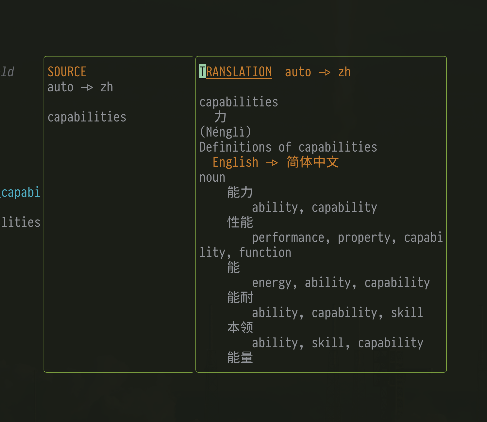
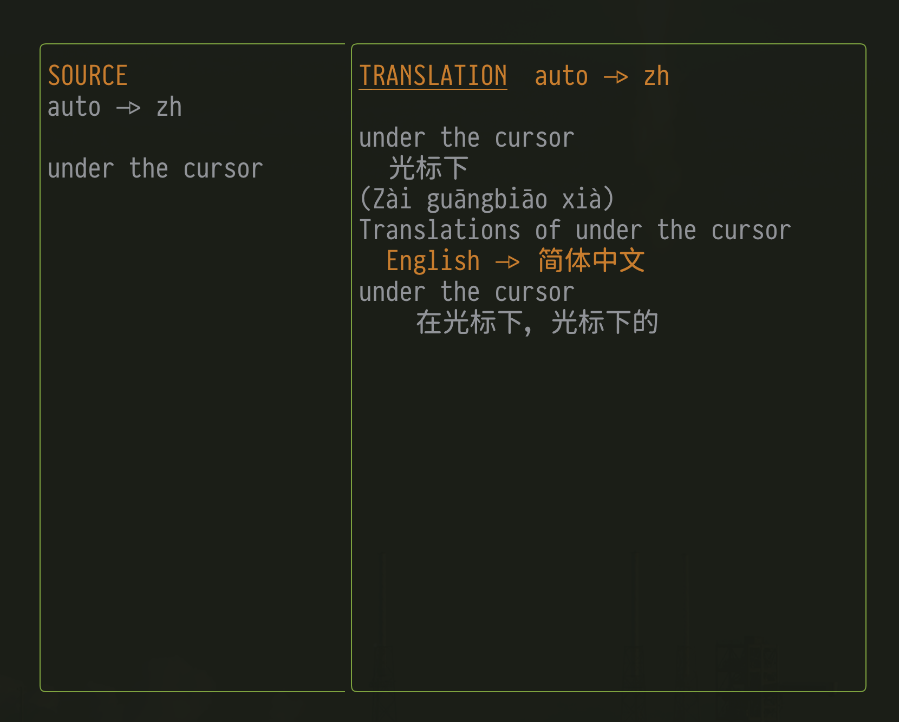

# A Neovim Translator Plugin


A Neovim plugin that wraps [translate-shell](https://github.com/soimort/translate-shell) so you can translate text directly from Neovim.

## Screenshots

### Translate Word Under Cursor


### Translate Visual Selection


## Prerequisites

Make sure you have [translate-shell](https://github.com/soimort/translate-shell) installed:

```bash
# macOS
brew install translate-shell

# Linux (Debian/Ubuntu)
sudo apt-get install translate-shell

# Or install via wget
wget git.io/trans
chmod +x ./trans
```

## Install

### Using [lazy.nvim](https://github.com/folke/lazy.nvim)

```lua
{
    "nicholasxjy/translator.nvim",
    event = "VeryLazy",
    opts = {
        default_target_lang = "zh",  -- Default target language
        default_source_lang = nil,   -- Default source language (nil = auto-detect)
        window = {
            width = 80,              -- Popup window width
            height = 20,             -- Popup window max height
        },
    },
}
```

### Using `vim.pack` (Neovim 0.12+)

`vim.pack` is Neovim's built-in plugin manager and currently requires a recent
Neovim build with `vim.pack` support plus `git` on your `PATH`.

```lua
vim.pack.add({
    { src = "https://github.com/nicholasxjy/translator.nvim" },
}, { load = true })

require("translator").setup({
    default_target_lang = "zh",  -- Default target language
    default_source_lang = nil,   -- Default source language (nil = auto-detect)
    window = {
        width = 80,              -- Popup window width
        height = 20,             -- Popup window max height
    },
})
```

After adding the plugin, restart Neovim if needed. To update plugins managed by
`vim.pack`, run `:lua vim.pack.update()`.

## How to use

### Basic Commands

```vim
" Translate specific text to Chinese
:Trans text=hello to=zh

" Translate a sentence without quotes
:Trans hello world to=zh

" Translate a sentence with quotes
:Trans text="hello world" to=zh

" Translate visual selection to Chinese (select text first, then run command)
:'<,'>Trans to=zh

" Translate word under cursor to Chinese
:TransWord to=zh

" Translate word under cursor with source and target language
:TransWord from=en to=zh

" Translate word under cursor using default target language
:TransWord

" Translate with source and target language
:Trans text=你好 from=zh to=en
```

### Lua API

You can also call the translation functions directly from Lua code:

```lua
-- Translate current word under cursor
require('translator').transCurWord({ to = "zh" })
require('translator').transCurWord({ from = "en", to = "zh" })

-- Translate visual selection
require('translator').transVisualSel({ to = "en" })
require('translator').transVisualSel({ from = "zh", to = "en" })

-- Example: Custom keybinding using Lua API
vim.keymap.set('n', '<leader>tw', function()
    require('translator').transCurWord({ to = "zh" })
end, { desc = "Translate word to Chinese" })

vim.keymap.set('v', '<leader>ts', function()
    require('translator').transVisualSel({ to = "zh" })
end, { desc = "Translate selection to Chinese" })
```

### Configuration with Keybindings

```lua
{
    "nicholasxjy/translator.nvim",
    event = "VeryLazy",
    opts = {
        default_target_lang = "zh",
        window = {
            width = 80,
            height = 20,
        },
    },
    keys = {
        -- Translate visual selection to Chinese
        { "<leader>tc", ":'<,'>Trans to=zh<cr>", mode = "v", desc = "Translate to Chinese" },
        -- Translate visual selection to English
        { "<leader>te", ":'<,'>Trans to=en<cr>", mode = "v", desc = "Translate to English" },
        -- Translate visual selection to Japanese
        { "<leader>tj", ":'<,'>Trans to=ja<cr>", mode = "v", desc = "Translate to Japanese" },
        -- Translate word under cursor to Chinese
        { "<leader>tw", "<cmd>TransWord to=zh<cr>", mode = "n", desc = "Translate word to Chinese" },
        -- Translate word under cursor using default language
        { "<leader>tt", "<cmd>TransWord<cr>", mode = "n", desc = "Translate word" },
    }
}
```

### Features

- **Popup Window**: Translation results are displayed in a centered two-pane popup
- **Visual Selection**: Select text and translate it directly
- **Word Translation**: Translate the word under cursor with `:TransWord` command
- **Multi-word Command Input**: `:Trans` supports bare text and quoted `text=` values
- **Full Translation Results**: Display complete translation information including pronunciation, definitions, and examples
- **Markdown Formatting**: Translation results are displayed with markdown syntax highlighting
- **Flexible Parameters**: Support for `text=`, `to=`, and `from=` parameters
- **Async Execution**: Translation runs asynchronously to avoid blocking Neovim
- **Error Handling**: Shows clear notifications when translation fails or `trans` is missing
- **Easy Close**: Press `q` or `<Esc>` to close the popup window
